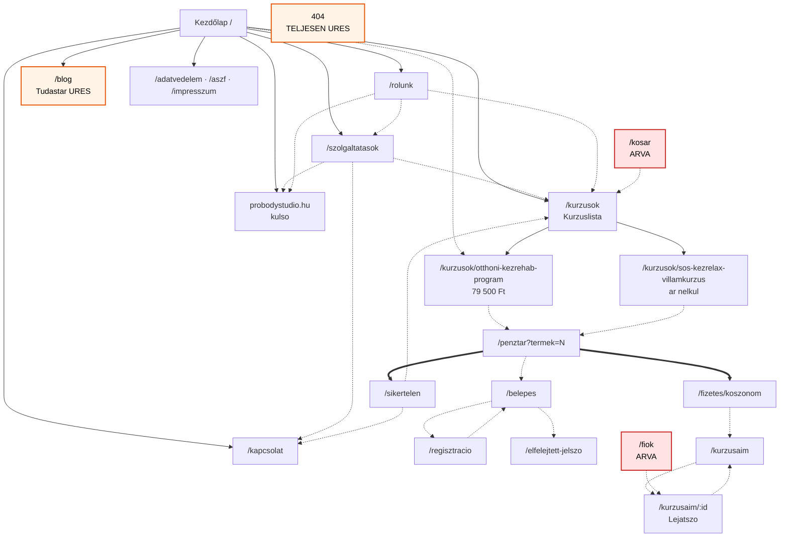
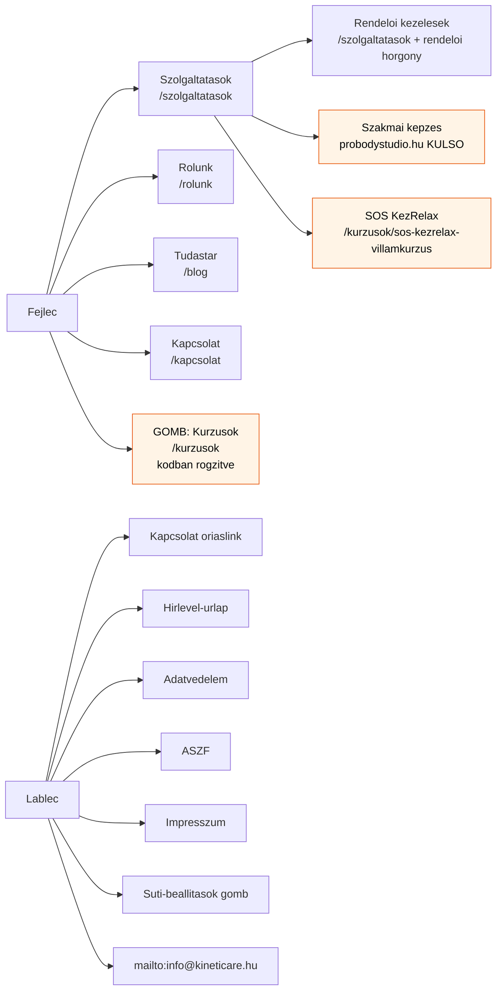
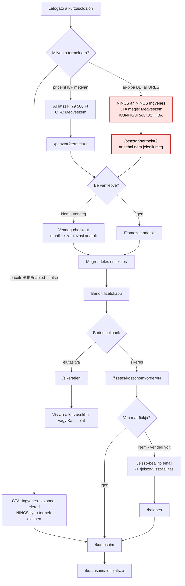

# Információs architektúra — teljes térkép és hibalista

**Készült:** 2026-08-16 · **Vizsgált állapot:** `main` @ `92dc88c` + élő oldal
(`https://kineticare-production.up.railway.app`) · **Módszer:** kód-olvasás +
olvasó (GET) HTTP-mérés az élő oldalon.

Ez a dokumentum **leltár és diagnózis**, nem javítási napló. A javításokat a
vezető osztja ki; itt csak a mért állapot és a javaslat szerepel.

---

## 0. Vezetői összefoglaló

A rendszer **működik**, de az információs architektúrája **kettéhasadt**:

- A **marketing-fele** (kezdőlap, szolgáltatások, rólunk, kurzusok) rendezett,
  konzisztens fejléc/lábléc-kerettel, morzsamenüvel a kurzusoldalakon.
- A **tranzakciós és fiók-fele** (belépés, kosár, pénztár, fiók, kurzusaim)
  **nincs bekötve a navigációba**. Egyetlen menüpont, gomb vagy lábléc-link sem
  vezet oda. Aki egyszer vásárolt, a saját kurzusaihoz csak a vásárlás utáni
  e-mailből vagy URL-begépeléssel jut vissza.

A három legsúlyosabb, mérhető hiba:

1. **A 404-oldal teljesen üres** — se fejléc, se lábléc, se szöveg, se link.
   Bármely elgépelt vagy elavult URL zsákutca.
2. **Nincs belépés/fiók belépési pont** a site-kereten sehol.
3. **Az „ingyenes" kurzus nem ingyenes** — a kód saját definíciója szerint
   konfigurációs hibában áll: „Megveszem" gomb, **ár nélkül**, számlázási
   űrlappal.

---

## 1. Módszertan

| Lépés | Eszköz | Mit adott |
| --- | --- | --- |
| Útvonal-leltár | `find src/app` | statikus + dinamikus route-ok |
| Menüfa | `src/lib/menu-tree.ts` + élő HTML | a menü CMS-vezérelt, nem hardcode |
| Link-gráf | élő HTML `<main>` / `<header>` / `<footer>` szerinti bontás | ki hova visz, kereten belül vs. tartalomban |
| Törött link | `curl -o /dev/null -w "%{http_code}"` minden élő linkre | HTTP-státusz |
| Horgony | a linkelt `#id` létezik-e a cél-HTML-ben | törött horgony |
| Árvaság | repó-szintű `href` keresés + sitemap | mire nem mutat semmi |

> **Megjegyzés a mérésről.** A kereten belüli (fejléc/lábléc) és a tartalmi
> linkeket külön kezeltem. Enélkül minden oldal „gazdagnak" látszik: a 14
> keret-link minden oldalon ott van, és elfedi, hogy a `<main>`-ben nulla
> továbblépés van.

---

## 2. Teljes útvonal-leltár

### 2.1 Nyilvános storefront

| Útvonal | Cím (`<title>`) / `<h1>` | Cél | Hozzáférés | Honnan érhető el | HTTP |
| --- | --- | --- | --- | --- | --- |
| `/` | *Kineticare – kézrehabilitáció gyógytornászoktól* / „Hatékony és biztonságos módszerek…" | Belépő, tölcsér-tető | nyilvános | logó, `#tartalom` | 200 |
| `/kurzusok` | *Kurzusok* / „Kurzusok" | Kurzuslista, értékesítés belépője | nyilvános | fejléc-CTA, 6× kezdőlapi CTA, kosár/pénztár/hiba-oldalak | 200 |
| `/kurzusok/[slug]` | pl. *Otthoni KézRehab Program* | Értékesítési kurzusoldal | nyilvános | kurzuslista, kezdőlapi kártya, menü (SOS) | 200 |
| `/kurzusok?kategoria=<slug>` | *Kurzusok* | Kategória-szűrt lista | nyilvános | szűrő-chip | 200 |
| `/szolgaltatasok` | *Szolgáltatások – Kineticare \| Kineticare* / „A kezed folyton dolgozik…" | Rendelői kezelések | nyilvános | menü, kezdőlap, rólunk | 200 |
| `/rolunk` | *Rólunk – Kineticare \| Kineticare* / „A kéz a mindenünk" | Szakmai háttér, bizalom | nyilvános | menü, kezdőlap | 200 |
| `/blog` | *Tudástár* / „Tudástár" | Cikklista | nyilvános | menü („Tudástár") | 200 |
| `/blog/[slug]` | poszt | Cikk | nyilvános | — (jelenleg nincs poszt) | — |
| `/blog/kategoria/[slug]` | kategória | Szűrt cikklista | nyilvános | kategória-chip | — |
| `/kapcsolat` | *Kapcsolat* / „Kapcsolat" | Űrlap, időpontkérés | nyilvános | menü, óriás lábléc-link, szolgáltatások, hibaoldal | 200 |
| `/[slug]` | CMS-oldal | Jogi/szabad oldalak | nyilvános | lábléc | 200 |
| `/adatvedelem`, `/aszf`, `/impresszum` | jogi | Jogi kötelezettség | nyilvános | lábléc, pénztár, kapcsolat | 200 |

### 2.2 Tranzakciós útvonalak

| Útvonal | Cím / `<h1>` | Cél | Hozzáférés | Honnan érhető el | HTTP |
| --- | --- | --- | --- | --- | --- |
| `/kosar` | *Kosár* / „Kosár" | Kosár | nyilvános | **SEMMI — árva** | 200 |
| `/penztar?termek=<id>` | *Pénztár* / „Pénztár" | Checkout | nyilvános (vendég is) | kurzusoldali „Megveszem", mobil vásárlósáv | 200 |
| `/fizetes/koszonom?order=…` | *Köszönjük a vásárlást* / „Köszönjük!" | Visszaigazolás | rendelés-számmal | Barion-visszatérés | 200 |
| `/sikertelen` | *A fizetés nem sikerült* | Hibakezelés | nyilvános | Barion-visszatérés | 200 |

### 2.3 Auth és fiók

| Útvonal | Cím / `<h1>` | Cél | Hozzáférés | Honnan érhető el | HTTP |
| --- | --- | --- | --- | --- | --- |
| `/belepes` | *Belépés* / „Belépés" | Bejelentkezés | nyilvános | **csak** pénztár-szövegLink + gate-átirányítás | 200 |
| `/regisztracio` | *Regisztráció* / „Regisztráció" | Fiók létrehozása | nyilvános | **csak** `/belepes` | 200 |
| `/elfelejtett-jelszo` | *Elfelejtett jelszó* / „Elfelejtetted a jelszavad?" | Jelszó-visszaállítás | nyilvános | `/belepes` | 200 |
| `/jelszo-visszaallitas` | *Új jelszó beállítása* | Új jelszó | token | e-mail-link | 200 |
| `/fiok` | *Fiókom* | Adatok, rendelések, kurzusok | **belépett** | **SEMMI — árva** | 307 → `/belepes?returnUrl=/fiok` |
| `/kurzusaim` | *Kurzusaim* | Megvett kurzusok | **belépett** | köszönőoldal, lejátszó | 307 → `/belepes?returnUrl=/kurzusaim` |
| `/kurzusaim/[id]` | *Kurzus lejátszása* | Videólejátszó | **vásárló** | `/kurzusaim`, `/fiok` | — |

### 2.4 Admin és technikai

| Útvonal | Cél | Hozzáférés |
| --- | --- | --- |
| `/admin/[[...segments]]` | *Irányítópult – Kineticare admin* (Payload) | staff / owner |
| `/api/*`, `/(payload)/api/*` | REST-végpontok | vegyes, `robots.txt` tiltja |
| `/next/preview`, `/next/exit-preview` | Piszkozat-előnézet | staff / owner |
| `/sitemap.xml`, `/robots.txt` | Gépi | nyilvános |

---

## 3. Gráfok

### 3.1 Fő navigációs gráf

Folytonos nyíl = keretből (fejléc/lábléc) elérhető; szaggatott = csak
tartalmi linkből; piros = elszigetelt zóna.



**Amit a gráf megmutat:** a `KOSAR` és a `FIOK` csomópontba **egyetlen nyíl sem
fut be**. A `BELEP` csomópontba is csak a `PENZ`-ből, egy szövegLinken át.

### 3.2 Menü-hierarchia fa

A menü **nem hardcode**, a Payload `menus` collectionből épül
(`src/lib/menus.ts:22` → `buildNavTree`). A „Kurzusok" gomb a **kivétel**:
kódban rögzített (`src/components/layout/Header.tsx:43`).



**Taxonómiai hiba:** az `S3` (SOS KézRelax) egy **kurzus**, mégis a
„Szolgáltatások" (= rendelői kezelés) almenüjében ül, egy **külső** szakmai
képzés mellett. Három különböző dolog egy fiókban.

### 3.3 Vásárlási folyamat döntési pontokkal



**Döntési pontok, ahol a folyamat sérül:**

- **`B` ág (ár):** élesben *egyetlen* termék sincs `free` állapotban, tehát a
  `D` ág soha nem fut. Az „ingyenes" kurzus az `E` (hibás) ágon megy.
- **`G` ág (vendég vs. belépett):** jól megoldott — a vendég-checkout
  megengedett, ez összhangban van a Baymard kutatásával (lásd 8. fejezet).
- **`O` ág:** a vendég-vásárló jelszó-beállító e-mailre van utalva. Ha az
  e-mail nem érkezik meg, **nincs felületi visszaút** a megvett kurzushoz,
  mert `/belepes` sehonnan nem érhető el a menüből.

---

## 4. Belépési pont → cél mátrix

Sor = ahonnan indul; oszlop = elérhető-e onnan **egy kattintással**.
`K` = keretből (fejléc/lábléc, minden oldalon), `T` = tartalmi link,
`—` = nem érhető el.

| Belépési pont ↓ / Cél → | Kezdő | Kurzusok | Kurzus­oldal | Pénztár | Szolg. | Rólunk | Tudástár | Kapcs. | Jogi | Belépés | Fiók/Kurzusaim | Kosár |
| --- | --- | --- | --- | --- | --- | --- | --- | --- | --- | --- | --- | --- |
| Kezdőlap | — | K+T | T | — | K+T | K+T | K | K+T | K | **—** | **—** | **—** |
| /kurzusok | K | — | T | — | K | K | K | K | K | **—** | **—** | **—** |
| Kurzusoldal | K | K+T | — | T | K | K | K | K | K | **—** | **—** | **—** |
| /szolgaltatasok | K | K+T | K (SOS) | — | — | K | K | K+T | K | **—** | **—** | **—** |
| /rolunk | K | K+T | K (SOS) | — | K+T | — | K | K | K | **—** | **—** | **—** |
| /blog (Tudástár) | K | K | K (SOS) | — | K | K | — | K | K | **—** | **—** | **—** |
| /kapcsolat | K | K | K (SOS) | — | K | K | K | — | K+T | **—** | **—** | **—** |
| Jogi oldalak | K | K | K (SOS) | — | K | K | K | K | K | **—** | **—** | **—** |
| /penztar | K | K+T | K (SOS) | — | K | K | K | K | K+T | **T** | **—** | **—** |
| /fizetes/koszonom | K+T | K | K (SOS) | — | K | K | K | K+T | K | T | **T** | **—** |
| /sikertelen | K | K+T | K (SOS) | — | K | K | K | K+T | K | **—** | **—** | **—** |
| /belepes | K | K | K (SOS) | — | K | K | K | K | K | — | **—** | **—** |
| /kosar | K | K+T | K (SOS) | — | K | K | K | K | K | **—** | **—** | — |
| **404-oldal** | **—** | **—** | **—** | **—** | **—** | **—** | **—** | **—** | **—** | **—** | **—** | **—** |

**A mátrix két oszlopa üres:** „Belépés" és „Fiók/Kurzusaim". Ez a
diagnózis lényege — a visszatérő vevőnek nincs bejárata.

**A 404 sora teljesen üres:** onnan *sehova* nem lehet menni.

---

## 5. Link- és gombgráf oldalanként (élő mérés)

A `<main>`-en belüli linkek. A 14 keret-link (fejléc 16 `<a>`, lábléc 6 `<a>`)
minden oldalon azonos — kivéve a 404-et, ahol **0**.

| Oldal | Tartalmi linkek / gombok |
| --- | --- |
| `/` | `/kurzusok` (**6×**: „Kurzusok megtekintése", „Összes kurzus megtekintése", „Elindítom az ingyenes kurzust", „Tovább a programra", „Megnézem a kurzusokat"), `#ingyenes`, `/rolunk`, `/kurzusok/otthoni-kezrehab-program` (kártya), `/szolgaltatasok`, probodystudio.hu |
| `/kurzusok` | `/kurzusok` („Összes"), `/kurzusok?kategoria=kezrehabilitacios-kurzusok`, 2 kurzuskártya |
| `/kurzusok/otthoni-…` | morzsamenü → `/kurzusok`; `/penztar?termek=1` („Megveszem"); horgonyok: `#kinek-valo`, `#mi-ez`, `#hogyan-mukodik`, `#garancia`; mobil vásárlósáv |
| `/kurzusok/sos-…` | morzsamenü → `/kurzusok`; `/penztar?termek=2` („Megveszem"); horgonyok: `#tananyag`, `#mi-ez`, `#hogyan-mukodik`, `#garancia`, `#gyik`; mobil vásárlósáv |
| `/szolgaltatasok` | `/kapcsolat` (2×), `/kurzusok` (2×), probodystudio.hu |
| `/rolunk` | `/szolgaltatasok`, `/kurzusok` (2×), probodystudio.hu |
| `/blog` | **0** |
| `/kapcsolat` | `/adatvedelem`; gomb: „Üzenet küldése" |
| `/adatvedelem`, `/aszf`, `/impresszum` | **0** |
| `/kosar` | `/kurzusok` („Nézd meg a kurzusainkat") |
| `/penztar` (üres) | `/kurzusok` („Válassz kurzust") |
| `/penztar?termek=N` | `/belepes` („be is jelentkezhetsz"), `/aszf`; gomb: „Megrendelés és fizetés" |
| `/fizetes/koszonom` | `/kurzusaim` |
| `/sikertelen` | `/kurzusok`, `/kapcsolat` |
| `/belepes` | `/regisztracio?returnUrl=%2Fkurzusaim`, `/elfelejtett-jelszo` |
| `/regisztracio` | `/belepes?returnUrl=%2Fkurzusaim` |
| `/elfelejtett-jelszo` | `/belepes` |
| `/jelszo-visszaallitas` | `/elfelejtett-jelszo` |
| **404** | **0 link, 0 gomb, 0 szöveg** |

---

## 6. Hibavadászat — bizonyítékkal

### 6.1 ZSÁKUTCA (dead end)

| # | Hely | Bizonyíték | Súly |
| --- | --- | --- | --- |
| Z1 | **404-oldal** | `GET /nincs-ilyen-oldal-teszt-404` → **HTTP 404**, 16 391 B. A `<body>` belseje: `<div hidden=""><!--$--><!--/$--></div>` + scriptek. `has <header>: False`, `has <footer>: False`, `<a> count: 0`. A `<title>` helyes („Az oldal nem található (404) \| Kineticare"), tehát a `src/app/(frontend)/not-found.tsx` metaadata alkalmazódik, de a **JSX nem renderelődik**, és a layout kerete is hiányzik. Ugyanez mély úton: `GET /kurzusok/nincs-ilyen` → 404, `<a> count: 0`. | **kritikus** |
| Z2 | `/blog` (Tudástár) | `GET /blog` → 200, `<main>`-ben **0 link**. Szöveg: „Ebben a kategóriában még nincs cikk." Nincs CTA, nincs kategória-chip (0 kategória). | magas |
| Z3 | Jogi oldalak (`/adatvedelem`, `/aszf`, `/impresszum`) | mindhárom: `<main>`-ben **0 link**. Csak a keret visz tovább. | közepes |
| Z4 | `/kapcsolat` | `<main>`-ben 1 link, az is a `/adatvedelem`-re (jogi kitétel). Az űrlap elküldése után nincs következő lépés felkínálva. | közepes |

> **Forrás:** az NN/g szerint a hibaoldalnak bocsánatot kell kérnie, jeleznie a
> hibát, és **teljes oldalnavigációt + keresőmezőt** kell adnia, hogy a
> látogató újratájékozódhasson — „avoid making navigational dead ends".
> [Improving the Dreaded 404 Error Message](https://www.nngroup.com/articles/improving-dreaded-404-error-message/)

### 6.2 ÁRVA oldal (semmi nem linkel rá)

| # | Oldal | Bizonyíték | Súly |
| --- | --- | --- | --- |
| A1 | **`/kosar`** | Repó-szintű keresés: a `/kosar` string **kizárólag kommentekben** fordul elő (`src/components/checkout/CartView.tsx:18,39`; `src/app/(frontend)/kosar/page.tsx:46,58`; `src/app/(frontend)/penztar/page.tsx:57,77`). Egyetlen `href` sem mutat rá. A „Megveszem" gomb a `checkoutHref()`-en át **közvetlenül** a `/penztar?termek={id}`-re megy (`src/lib/courses.ts:26,41-43`). Az oldal él (`GET /kosar` → 200) és működő kosár-logikát renderel — amit a UI soha nem használ. | magas |
| A2 | **`/fiok`** | Egyetlen `href` sem mutat rá a storefronton (csak a `redirect('/belepes?returnUrl=/fiok')` önmagára). `GET /fiok` → **307** → `/belepes?returnUrl=/fiok`. | magas |
| A3 | `/belepes`, `/regisztracio` | A site-keretből elérhetetlen. Egyetlen tartalmi belépő: a pénztár szövegLinkje („be is jelentkezhetsz", `GET /penztar?termek=1`). | **kritikus** |
| A4 | `#kurzusok` és `#velemenyek` horgony a kezdőlapon | Az `id="kurzusok"` és `id="velemenyek"` **létezik** a kezdőlap HTML-jében, de **egyetlen link sem** mutat rájuk sem a kezdőlapról, sem a menüből. Latens, kihasználatlan horgony. | alacsony |
| A5 | `/blog/kategoria/[slug]` | 0 kategória és 0 poszt él, a route soha nem hívódik. A sitemap 11 URL-jében sem szerepel. | alacsony |

**Sitemap-ellenőrzés (`GET /sitemap.xml` → 200, 11 URL):** `/`, `/kurzusok`,
`/blog`, `/kapcsolat`, `/impresszum`, `/adatvedelem`, `/aszf`,
`/szolgaltatasok`, `/rolunk`, és a 2 kurzus. **Egyetlen blogposzt és kategória
sincs benne** — megerősíti, hogy a Tudástár üres.

### 6.3 TÖRÖTT vagy céltalan link / horgony

**Jó hír: nincs 404-es link az élő oldalon.** Mind a 21 különböző cél
átment a sweepen:

```
200 /            200 /adatvedelem   200 /aszf        200 /belepes
200 /blog        200 /elfelejtett-jelszo             200 /impresszum
200 /kapcsolat   307 /kurzusaim (gate, helyes)       200 /kurzusok
200 /kurzusok/otthoni-kezrehab-program               200 /penztar?termek=1
200 /kurzusok/sos-kezrelax-villamkurzus              200 /penztar?termek=2
200 /kurzusok?kategoria=kezrehabilitacios-kurzusok   200 /rolunk
200 /regisztracio?returnUrl=%2Fkurzusaim             200 /szolgaltatasok
200 /szolgaltatasok#rendeloi                         200 https://probodystudio.hu/kez-workshop/
```

**Horgony-ellenőrzés — minden ténylegesen linkelt horgony célja létezik:**
`#rendeloi` ✓ `/szolgaltatasok`-on · `#ingyenes` ✓ kezdőlapon ·
`#mi-ez`, `#hogyan-mukodik`, `#garancia`, `#tananyag`, `#gyik` ✓ a SOS-oldalon ·
`#kinek-valo`, `#mi-ez`, `#hogyan-mukodik`, `#garancia` ✓ az Otthoni oldalon.

**Céltalan (félrevezető) linkek — ezek a valódi bajok:**

| # | Link | Mért viselkedés | Baj |
| --- | --- | --- | --- |
| T1 | Kezdőlap: **„Elindítom az ingyenes kurzust →"** | `href="/kurzusok"` (a kurzuslistára), **nem** az ingyenes kurzusra | A gomb konkrét ígéretet tesz („elindítom"), és egy listára dob. Ok: `src/components/content/home/FreeSos.tsx:70-73` — `href: freeProduct ? courseHref(freeProduct) : '/kurzusok'`, és élesben **`freeProduct === null`**, mert egy termék sincs `priceInHUFEnabled: false` állapotban (`HomeView.tsx:133`). |
| T2 | Kezdőlap: **„Tovább a programra →"** | `href="/kurzusok"` | A „program" konkrétan az Otthoni KézRehab Program; a link mégis a listára visz. |
| T3 | `/kurzusok?kategoria=kezrehabilitacios-kurzusok` | **Ugyanazt a 2 kurzust** adja, mint az „Összes" | Nulla-hatású szűrő; két URL, azonos tartalom. |

### 6.4 DUPLIKÁLT út (ugyanaz a cél, több néven)

| # | Duplikáció | Bizonyíték |
| --- | --- | --- |
| D1 | **`/kurzusok` 6 különböző néven a kezdőlapon** | „Kurzusok megtekintése", „Összes kurzus megtekintése→", „Elindítom az ingyenes kurzust →", „Tovább a programra→", „Megnézem a kurzusokat", + a fejléc „Kurzusok" gombja. Hat felirat, egy cél — a látogató azt hiszi, hat különböző helyre jut. |
| D2 | **Kurzuslista két URL-en** | `/kurzusok` és `/kurzusok?kategoria=kezrehabilitacios-kurzusok` azonos tartalom (mérve). |
| D3 | **Kurzusaim két helyen** | `/kurzusaim` (CourseList) **és** `/fiok` „Kurzusaim" szekciója (`src/components/account/AccountView.tsx:163,188`) ugyanazt a listát adja, ugyanazokkal a `/kurzusaim/{id}` linkekkel. Két felület, egy funkció. |
| D4 | **SOS kurzus két úton, két néven** | Menü: „SOS KézRelax" (Szolgáltatások almenü) · Lista: „SOS Kézrelax villámkurzus" · Kezdőlap: „Ingyenes SOS gyakorlatok". Három név, egy termék. |
| D5 | **Kapcsolat kétszer a kereten** | Fejléc-menü „Kapcsolat" + lábléc óriás „Kapcsolat" link. (Ez elfogadható redundancia, csak jelzem.) |

> **Forrás:** az NN/g „Top 10 IA Mistakes" listáján a **„Extreme
> Polyhierarchy"** (ugyanaz az elem túl sok helyen) és a **„Made-Up Menu
> Options"** (kitalált címkék a megszokott helyett) is szerepel.
> [Top 10 Information Architecture Mistakes](https://www.nngroup.com/articles/top-10-ia-mistakes/)

### 6.5 INKONZISZTENS elnevezés (menüpont ≠ oldalcím)

| # | Menü/link felirat | Oldal `<h1>` | Oldal `<title>` | Baj |
| --- | --- | --- | --- | --- |
| N1 | **„Tudástár"** | „Tudástár" | „Tudástár \| Kineticare" | Az **URL** `/blog` — a címke és a cím magyar, az útvonal angol. Megosztott linken a felhasználó „blogot" lát, a menüben „Tudástárt". |
| N2 | **„Rólunk"** | **„A kéz a mindenünk"** | „Rólunk – Kineticare \| Kineticare" | A menüpont és az oldal első látható címe nem egyezik → a látogató nem kap visszaigazolást, hogy jó helyen jár („You are here" hiánya). |
| N3 | **„Szolgáltatások"** | **„A kezed folyton dolgozik – segítünk, hogy közben ne fájjon"** | „Szolgáltatások – Kineticare \| Kineticare" | ugyanaz, mint N2 |
| N4 | **„SOS KézRelax"** (menü) | „SOS Kézrelax villámkurzus" | „SOS Kézrelax villámkurzus \| Kineticare" | Kis-/nagybetű és szóhasználat is eltér (KézRelax vs. Kézrelax). |
| N5 | `<title>` **dupla márkanév** | — | „Rólunk – Kineticare **\| Kineticare**", „Szolgáltatások – Kineticare **\| Kineticare**" | A CMS-ben a `seoTitle` már tartalmazza a márkát, a sablon még egyszer hozzáteszi. Keresőtalálatban csúnya és levágódik. |
| N6 | **Elgépelés** | — | — | `src/components/checkout/CartView.tsx:103`: `Tovább a **penztárhoz**` — hiányzó ékezet („pénztárhoz"). (Árva oldalon van, ezért élesben nem látszik.) |
| N7 | **Rossz üres-állapot szöveg** | — | — | `src/app/(frontend)/blog/page.tsx:32`: „**Ebben a kategóriában** még nincs cikk." — szűretlen listán is ezt írja, holott nincs kiválasztott kategória. |

> **Forrás:** az NN/g navigációs alapelve, hogy a lap adjon visszaigazolást a
> helyről („You are here"), és a címkék a felhasználó nyelvén szóljanak.
> [Navigation: You Are Here](https://www.nngroup.com/articles/navigation-you-are-here/) ·
> a GOV.UK ugyanezt a konzisztencia-elvet írja elő szolgáltatásokra:
> [Making your service look like GOV.UK](https://www.gov.uk/service-manual/design/making-your-service-look-like-govuk)

### 6.6 MÉLYSÉG — hány kattintás? (mérve)

| Cél | Legrövidebb út | Kattintás | Értékelés |
| --- | --- | --- | --- |
| **Kapcsolat** | Kezdőlap → fejléc „Kapcsolat" (vagy lábléc óriáslink) | **1** | jó |
| **Kurzuslista** | Kezdőlap → fejléc „Kurzusok" gomb | **1** | jó |
| **Fizetős kurzus oldala** | Kezdőlap → kurzuskártya („Otthoni KézRehab Program") | **1** | jó |
| **Fizetős vásárlás (pénztár-űrlap)** | Kezdőlap → kártya → „Megveszem" | **2** | jó |
| **Fizetős vásárlás (fizetőkapu)** | + „Megrendelés és fizetés" | **3** | jó |
| **Ingyenes kurzus oldala** | Kezdőlap → „Ingyenes SOS gyakorlatok" (`#ingyenes`, lapon belül) → „Elindítom az ingyenes kurzust" → `/kurzusok` → SOS-kártya | **3** | **rossz** — és a végén sem ingyenes |
| *(alternatíva)* | Kezdőlap → „Szolgáltatások" almenü nyitása → „SOS KézRelax" | **2** (desktopon hover, mobilon fiók-nyitás) | rejtett út, rossz kategóriában |
| **Tudástár tartalma** | Kezdőlap → „Tudástár" | **1** → **üres oldal** | tartalom hiánya |
| **Belépés** | Kezdőlap → „Kurzusok" → kurzus → „Megveszem" → „be is jelentkezhetsz" | **4** | **kritikus** — a menüből 0 út |
| **Kurzusaim (visszatérő vevő)** | Belépés után átirányítás; menüből **nem elérhető** | **∞** | **kritikus** |
| **Fiók/adataim** | csak URL-begépeléssel | **∞** | **kritikus** |
| **Kosár** | csak URL-begépeléssel | **∞** | árva |

### 6.7 VISSZAÚT (van-e világos út vissza a mély oldalakról?)

| Oldal | Visszaút | Értékelés |
| --- | --- | --- |
| Kurzusoldal | **Morzsamenü** („Kurzusok / <cím>", `src/app/(frontend)/kurzusok/[slug]/page.tsx:420-427`) + teljes keret | **jó** — az egyetlen hely, ahol van morzsamenü |
| `/penztar?termek=N` | csak a fejléc; **nincs** „vissza a kurzushoz" link | gyenge |
| `/fizetes/koszonom` | `/kurzusaim` + „Vissza a kezdőlapra" | jó |
| `/sikertelen` | „Vissza a kurzusokhoz" + „Kapcsolat" | jó |
| `/kurzusaim/[id]` (lejátszó) | „Vissza a kurzusaimhoz" (`CoursePlayer.tsx:825,870`) | jó |
| `/szolgaltatasok`, `/rolunk`, `/blog`, jogi | **nincs morzsamenü**, csak a keret | közepes |
| **404** | **semmi** | **kritikus** |
| **Kijelentkezés** | **A teljes storefronton nincs** — a `logout`/`kijelentkez` szó egyetlen UI-komponensben sem fordul elő | **magas** |

> **Forrás:** a morzsamenü mérten csak hasznot hoz, kárt nem, és pont azoknak
> segít, akik külső linkről/keresőből érkeznek mélyre.
> [Breadcrumbs: 11 Design Guidelines](https://www.nngroup.com/articles/breadcrumbs/) ·
> [Breadcrumb Navigation Increasingly Useful](https://www.nngroup.com/articles/breadcrumb-navigation-useful/)

### 6.8 A Tudástár / blog jelenlegi állapota

| Kérdés | Mért válasz |
| --- | --- |
| Van-e tartalom? | **Nincs.** `GET /blog` → 200, `<main>`: „Tudástár" + „Ebben a kategóriában még nincs cikk." |
| Van-e kategória? | **Nincs.** A `CategoryFilter` `categories.length === 0` esetén `null`-t ad (`src/components/content/CategoryFilter.tsx:19-21`) — a chipek nem is renderelődnek. |
| Szerepel-e a sitemapban? | Csak maga a `/blog` (1 URL). **0 poszt, 0 kategória.** |
| Látszik-e a kezdőlapon? | **Nem.** A `KnowledgeSection` `shownPosts.length === 0` esetén `null`-t ad (`KnowledgeSection.tsx:56-58`), így a „Legfrissebb a tudástárból" szekció eltűnik. |
| Hova vezet? | **Sehova.** 0 tartalmi link. |
| Következmény | Egy **négyből egy** főmenüpont üres oldalra visz. A látogató a menü 25%-át elpazarolja egy semmire. |

---

## 7. TOP 10 IA-hiba, súlyozva

Súlyozás: *hatás* (mennyire töri a fő célt) × *gyakoriság* (hány látogatót ér).

| # | Hiba | Bizonyíték | Hatás | Súly |
| --- | --- | --- | --- | --- |
| **1** | **A 404-oldal teljesen üres** — nincs fejléc, lábléc, szöveg, link | `GET /nincs-ilyen-oldal-teszt-404` → **HTTP 404**; `<body>` = `<div hidden=""><!--$--><!--/$--></div>`; `has <header>: False`, `<a> count: 0`. Ugyanez `GET /kurzusok/nincs-ilyen` → 404, 0 link. A `<title>` viszont helyes → a `src/app/(frontend)/not-found.tsx` metaadata él, a JSX nem renderel. | Minden elgépelt/elavult URL végleges zsákutca. Régi kampánylinkek, keresőből érkező linkrot, megosztott URL-ek mind ide futnak. | **10** |
| **2** | **Nincs belépés/fiók belépési pont a site-kereten** | A kezdőlap HTML-jében: `/belepes: 0`, `/regisztracio: 0`, `/fiok: 0`, `/kurzusaim: 0`, `/kosar: 0` előfordulás. `src/components/layout/Header.tsx:30-52` — a fejléc csak logó + menü + „Kurzusok" gomb + hamburger. | A **visszatérő vevő** nem jut a megvett kurzusához. A belépés 4 kattintás mélyen, a pénztár szövegében rejtve. | **10** |
| **3** | **Az „ingyenes" kurzus nem ingyenes, és ár nélkül kér számlázási adatot** | `GET /kurzusok/sos-kezrelax-villamkurzus` → lead: „**Ingyenes** villámkurzus…", buybox: **nincs ár, nincs „Ingyenes" jelölés**, CTA: „**Megveszem**" → `GET /penztar?termek=2` → 200, a pénztár **nem mutat semmilyen összeget**, de kér e-mailt + számlázási nevet/címet. Összehasonlításul `/penztar?termek=1` → „79 500 Ft". A kód saját szavaival ez a `'none'` állapot: *„az ár-pipa BE van kapcsolva, de az ár ÜRES (**konfigurációs hiba**)"* — `src/lib/courses.ts:205-218`. | A tölcsér teteje (lead-magnet) törött; a látogató fizetési űrlapot kap ár nélkül. Jogi/ÁSZF-kockázat is. | **9** |
| **4** | **A Tudástár főmenüpont üres oldalra visz** | `GET /blog` → 200, `<main>`-ben **0 link**, szöveg: „Ebben a kategóriában még nincs cikk." Sitemap: **0 poszt, 0 kategória**. A kezdőlapi „Legfrissebb a tudástárból" szekció emiatt el sem készül (`KnowledgeSection.tsx:56-58`). | A 4 főmenüpont egyike (25%) elpazarolt; a SEO/GEO hosszútáv-stratégia nem indult el. | **8** |
| **5** | **A `/kosar` oldal árva és a folyamatból kiiktatott** | A `/kosar` string a repóban **csak kommentekben** (`CartView.tsx:18,39`; `kosar/page.tsx:46,58`; `penztar/page.tsx:57,77`) — 0 `href`. A „Megveszem" a `checkoutHref()`-fel közvetlenül `/penztar?termek={id}`-re megy (`src/lib/courses.ts:26,41-43`). Az oldal mégis él: `GET /kosar` → 200. | Karbantartott, tesztelt, de halott felület; több kurzus egyszerre nem vásárolható. Zavaró kettősség a kódban. | **7** |
| **6** | **Nincs kijelentkezés sehol a storefronton** | Teljes `src` keresés `logout\|kijelentkez\|sign.out` mintára: **egyetlen UI-komponensben sincs találat** (csak 3 komment `start-checkout.ts`-ben és `payload.config.ts`-ben). | Közös gépen belépve maradt fiók; a felhasználó nem tud fiókot váltani. Bizalmi és adatvédelmi kockázat. | **7** |
| **7** | **`/kurzusok` hatszor, hat különböző néven a kezdőlapon** | Kezdőlapi `<main>` mérés: „Kurzusok megtekintése", „Összes kurzus megtekintése→", „**Elindítom az ingyenes kurzust →**", „Tovább a programra→", „Megnézem a kurzusokat" — mind `href="/kurzusok"`; + fejléc „Kurzusok" gomb. Ok a félrevezetőkre: `FreeSos.tsx:70-73` fallback (`freeProduct === null`). | A látogató hat különböző ígéretet lát, egy helyre jut; a konkrét ígéretek („elindítom", „a programra") nem teljesülnek. | **7** |
| **8** | **Taxonómiai hiba: kurzus a „Szolgáltatások" almenüben, külső link mellett** | Élő menüfa: `Szolgáltatások` → `Rendelői kezelések` (`/szolgaltatasok#rendeloi`) + `Szakmai képzés` (**probodystudio.hu**, külső) + `SOS KézRelax` (**kurzus**). Közben a „Kurzusok" nem is menüpont, csak kódba égetett gomb (`Header.tsx:43`). | Három különböző dolog (helyszíni kezelés, külső képzés, online kurzus) egy fiókban; a fő bevételi objektum kimarad a menüfából. | **6** |
| **9** | **Menüpont-név ≠ oldalcím; dupla márkanév a `<title>`-ben** | „Rólunk" → `<h1>` **„A kéz a mindenünk"**; „Szolgáltatások" → `<h1>` **„A kezed folyton dolgozik…"**; „Tudástár" → URL `/blog`; „SOS KézRelax" vs. „SOS Kézrelax villámkurzus". `<title>`: „Rólunk – Kineticare **\| Kineticare**", „Szolgáltatások – Kineticare **\| Kineticare**". | Nincs „megérkeztem" visszaigazolás; a keresőtalálat csúnya és levágódik. | **5** |
| **10** | **Nulla-hatású kategória-szűrő + morzsamenü hiánya a belső oldalakon** | `GET /kurzusok?kategoria=kezrehabilitacios-kurzusok` **azonos** tartalom, mint `/kurzusok` (mérve). Morzsamenü **csak** a kurzusoldalakon van (`kurzusok/[slug]/page.tsx:420`); `/szolgaltatasok`, `/rolunk`, `/blog`, jogi oldalak: nincs. Ráadásul a kurzuslista két URL-konvenciót használ (`?kategoria=`), a blog egy harmadikat (`/blog/kategoria/<slug>`). | Duplikált URL (SEO), haszontalan UI-elem, gyenge újratájékozódás mélyről érkezőknek. | **4** |

**Kiegészítő, kisebb megfigyelések** (nem fértek a top 10-be):
`/fiok` és `/kurzusaim` funkcionális duplikáció (D3) · a kezdőlapi
`#kurzusok`/`#velemenyek` horgonyokra semmi nem mutat (A4) ·
`/kurzusok` leírása „szakmai továbbképzéseket" ígér, de a szakmai képzés
**külső** oldalon van és nincs a listában · `CartView.tsx:103` „penztárhoz"
elgépelés · `blog/page.tsx:32` rossz üres-állapot szöveg.

---

## 8. Javasolt IA-javítási terv

**A javításokat NEM végeztem el** — a kiosztás a vezető dolga. A sorrend
hatás/ráfordítás arány szerint.

### 8.1 Első hullám — „a ház ne legyen ajtó nélkül" (nagy hatás, kis ráfordítás)

| Sorrend | Teendő | Miért | Érintett fájl |
| --- | --- | --- | --- |
| 1 | **404-oldal megjavítása**: rendereljen kerettel (fejléc+lábléc), rövid magyarázattal, „Vissza a kezdőlapra" + „Kurzusok" + „Kapcsolat" hivatkozással. Ki kell deríteni, miért nem renderel a `not-found.tsx` JSX-e, holott a metaadata alkalmazódik. | Minden elgépelt URL ma végleges zsákutca. | `src/app/(frontend)/not-found.tsx`, `src/app/(frontend)/layout.tsx` |
| 2 | **Fiók-belépési pont a fejlécbe**: kilépett állapotban „Belépés", belépve „Kurzusaim" + „Fiók" + „Kijelentkezés" (mobilon a drawer aljára). | A visszatérő vevőnek ma nincs bejárata; kijelentkezés sehol nincs. | `src/components/layout/Header.tsx`, `MobileNav.tsx` |
| 3 | **Az ingyenes kurzus rendbetétele**: a SOS terméken a `priceInHUFEnabled`-et `false`-ra állítani a CMS-ben. Ettől a kód magától jóra vált: buybox „Ingyenes", CTA „Ingyenes — azonnal eléred", és a kezdőlapi „Elindítom az ingyenes kurzust" gomb **magától** a kurzusra mutat (`FreeSos.tsx:70-73`). | Három hibát old meg egyszerre, kódmódosítás nélkül. | CMS-adat (`products`), nem kód |
| 4 | **Üres-állapot szövegek**: `/blog` szűretlen listán „Hamarosan érkeznek a cikkek" + CTA a kurzusokra/kapcsolatra; a „Ebben a kategóriában…" csak szűrt nézetben. | Zsákutca oldja. | `src/app/(frontend)/blog/page.tsx:32` |

### 8.2 Második hullám — menüfa és elnevezés (közepes ráfordítás)

| Sorrend | Teendő | Miért |
| --- | --- | --- |
| 5 | **Menüfa átrendezése a CMS-ben**: „Kurzusok" legyen **valódi főmenüpont** (a gomb maradhat mellette CTA-ként); a „SOS KézRelax" kerüljön a Kurzusok alá, ne a Szolgáltatások alá; a külső „Szakmai képzés" kapjon egyértelmű külső jelölést (a `NavAnchor` már renderel ikont). | Ma egy kurzus a szolgáltatások közt ül, a fő bevételi objektum pedig kimarad a menüfából. Nem kell kódot írni: `menus` collection. |
| 6 | **Nevek egységesítése**: egy termék = egy név („SOS Kézrelax villámkurzus" mindenhol). A „Rólunk"/„Szolgáltatások" oldalak kapjanak a menüpont nevével egyező, látható címkét (kicsi eyebrow vagy H1-igazítás). | „You are here" visszaigazolás. |
| 7 | **`<title>` dupla márkanév megszüntetése**: vagy a CMS `seoTitle`-ből, vagy a sablon suffixéből tűnjön el a márka. | Keresőtalálat minősége. |
| 8 | **Döntés a Tudástárról**: vagy induljon el 3–5 cikkel (és akkor a kezdőlapi szekció is életre kel), vagy **a menüpont kerüljön ki** a fejlécből, amíg nincs tartalom. | Ma a menü 25%-a semmire visz. |

### 8.3 Harmadik hullám — folyamat és mélység (nagyobb ráfordítás)

| Sorrend | Teendő | Miért |
| --- | --- | --- |
| 9 | **Döntés a kosárról**: vagy bekötni (kurzusoldali „Kosárba" + fejléc-kosárikon, több kurzus egy rendelésben), vagy **kivezetni** a route-ot és a `CartView`-t. A mai félállapot a legrosszabb. | Halott, mégis karbantartott felület. |
| 10 | **Morzsamenü kiterjesztése** a `/szolgaltatasok`, `/rolunk`, `/blog`, `/blog/[slug]` és a jogi oldalakra (a kurzusoldali `kc-course-breadcrumb` mintájára). | Mélyre érkezőknek újratájékozódás; mérten csak haszon. |
| 11 | **Kezdőlapi CTA-k pontosítása**: a „Tovább a programra" mutasson a konkrét kurzusra, ne a listára; a hat azonos célú link csökkentése 2–3 világos, egymástól eltérő ígéretre. | Ma hat név, egy cél. |
| 12 | **Kategória-szűrő**: amíg egy kategória van, ne renderelődjön a chip-sor (a `CategoryFilter` már így viselkedik 0 elemnél — a kurzuslistán ugyanezt kell alkalmazni 1 elemnél); az URL-konvenciót egységesíteni a bloggal. | Duplikált URL + haszontalan UI. |
| 13 | **Pénztár visszaút**: „Vissza a kurzushoz" link a `/penztar` oldalra. | Ma csak a fejléc visz el. |
| 14 | **`/fiok` és `/kurzusaim` összevonása** vagy világos munkamegosztás (fiók = adatok+számlák, kurzusaim = tanulás), egymásra hivatkozó fülekkel. | Ma két felület, egy funkció. |

---

## 9. Hivatkozott IA-források

Minden alábbi állítás a hivatkozott oldalról származik, nem emlékezetből.

| Elv | Forrás |
| --- | --- |
| A hibaoldal kérjen bocsánatot, magyarázzon, és adjon **teljes navigációt + keresőt**; ne legyen navigációs zsákutca | [NN/g — Improving the Dreaded 404 Error Message](https://www.nngroup.com/articles/improving-dreaded-404-error-message/) |
| Hibaüzenet legyen közérthető, pontos és **konstruktív** (mondja meg, mit tegyen a felhasználó) | [NN/g — Error-Message Guidelines](https://www.nngroup.com/articles/error-message-guidelines/) |
| IA-hibák katalógusa: *No Structure*, *Missing Category Landing Pages*, *Extreme Polyhierarchy*, *Invisible Navigation Options*, *Inconsistent Navigation*, *Made-Up Menu Options* | [NN/g — Top 10 Information Architecture Mistakes](https://www.nngroup.com/articles/top-10-ia-mistakes/) |
| A navigáció adjon helyzet-visszaigazolást („You are here") | [NN/g — Navigation: You Are Here](https://www.nngroup.com/articles/navigation-you-are-here/) |
| A morzsamenü mérten csak haszonnal jár, kárt nem okoz; főleg a mélyre, külső linkről érkezőket menti meg | [NN/g — Breadcrumbs: 11 Design Guidelines](https://www.nngroup.com/articles/breadcrumbs/) · [NN/g — Breadcrumb Navigation Increasingly Useful](https://www.nngroup.com/articles/breadcrumb-navigation-useful/) |
| Zavaros IA rendbetételének módszerei | [NN/g — 6 Ways to Fix a Confused Information Architecture](https://www.nngroup.com/articles/fixing-information-architecture/) |
| A felhasználó nem megy tovább, ha nem tudja **előre felmérni a teljes költséget**; a váratlan/hiányzó költség a kosárelhagyás vezető oka | [Baymard — How to Audit Your Checkout Flow for Hidden Friction](https://baymard.com/learn/audit-checkout-flow-hidden-friction) · [Baymard — Checkout UX Guide](https://baymard.com/learn/checkout-flow-ux-optimization) |
| A **vendég-checkout** legyen elérhető és jól látható; a kényszerített regisztráció elhagyást okoz | [Baymard — Make "Guest Checkout" Prominent](https://baymard.com/blog/make-guest-checkout-prominent) |
| Konzisztens megjelenés és navigáció, hogy a felhasználó bízzon abban, jó helyen jár | [GOV.UK Service Manual — Making your service look like GOV.UK](https://www.gov.uk/service-manual/design/making-your-service-look-like-govuk) |
| A szolgáltatásnak legyen rendes belépő (start) oldala, amely bekapcsolja a többi tartalomba és a keresésbe | [GOV.UK Design System — Start using a service](https://design-system.service.gov.uk/patterns/start-using-a-service/) |

---

## 10. Függelék — a mérés reprodukálása

```bash
B=https://kineticare-production.up.railway.app

# 1. Útvonalak státusza
for p in / /kurzusok /blog /kapcsolat /rolunk /szolgaltatasok /belepes \
         /regisztracio /kosar /penztar /fiok /kurzusaim /adatvedelem /aszf \
         /impresszum /sikertelen /admin /fizetes/koszonom; do
  echo "$p -> $(curl -s -o /dev/null -w '%{http_code}|%{redirect_url}' "$B$p")"
done

# 2. A 404 üressége (a döntő bizonyíték)
curl -s "$B/nincs-ilyen-oldal-teszt-404" | grep -c '<header\|<footer\|<a '   # => 0

# 3. Az ingyenes kurzus ár nélküli pénztára
curl -s "$B/penztar?termek=1" | grep -o '79 500 Ft'      # => van ár
curl -s "$B/penztar?termek=2" | grep -o '[0-9 ]* Ft'     # => nincs találat

# 4. A Tudástár üressége
curl -s "$B/sitemap.xml" | grep -c '/blog/'              # => 0

# 5. A /kosar árvasága (repóban)
grep -rn "/kosar" src --include=*.tsx --include=*.ts | grep -v '^\s*\*'
```
